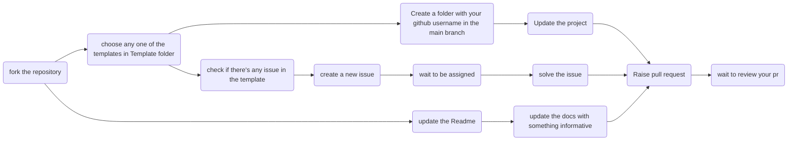

# Hacktoberfest 2023

   
   
   
   

# Hacktoberfest 2023

This is a repository created & maintained for the hactoberfest 2023, this is open to all & everyone irrespective of your coding levels.

## How It Works

Flow-chart representing how this repo. works :

_Note:_
_When Uploading & Submitting Pull Requests you need to submit it within a folder & the folder name must be your GitHub Username_

## How To Contribute

We welcome all contributions, suggestions & ideas for improvement.
You can contribute by creating your own project using the templates. If the projects that you contribute are valid then they are labeled with "hacktoberfest-accepted" if invalid or spam then it is labeled as "spam" or "invalid"

### Pre-Requistes 

- GitHub Account - [click here to create account](https://code.visualstudio.com/download)

- Visual Studio Code or any other code editor - [click here to download](https://code.visualstudio.com/download)

- Git version control - [click here to download](https://git-scm.com/)

- your interest and time😁😎

## Contributors of `Hacktoberfest 2023`

  

